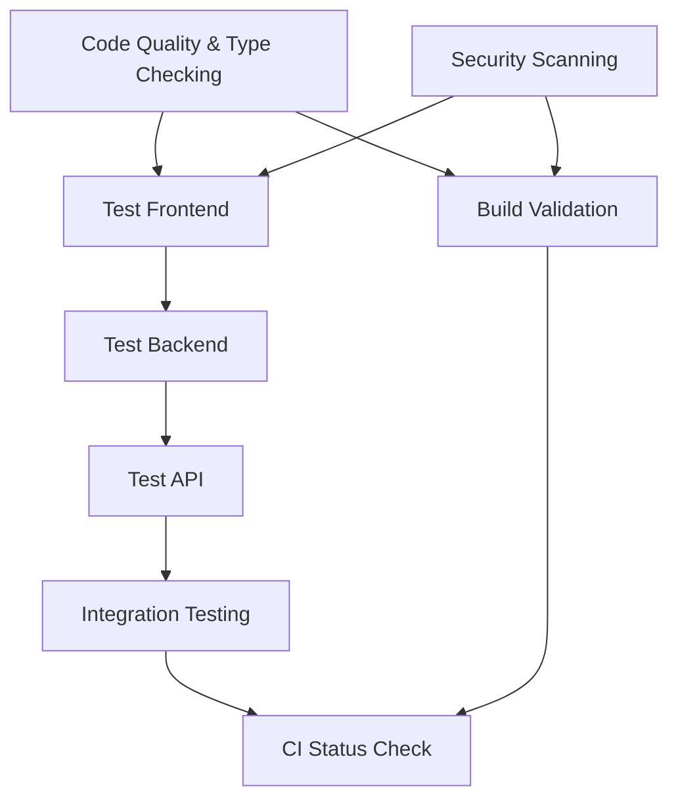
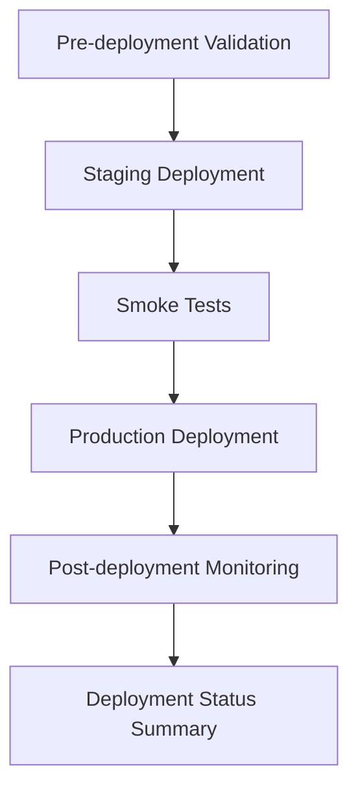

# 🚀 Comprehensive CI/CD Pipeline Documentation

## Overview

This document provides complete documentation for the enterprise-grade CI/CD pipeline implemented for the Fairytales with Spice project. The pipeline follows modern DevOps best practices with comprehensive security, quality gates, and automated deployment capabilities.

## 🏗️ Pipeline Architecture

### Core Workflows

| Workflow | Trigger | Purpose | Duration |
|----------|---------|---------|----------|
| **CI Pipeline** | Push/PR to main/develop | Code quality, testing, build validation | ~15-20 min |
| **Deployment Pipeline** | Push to main, manual dispatch | Automated staging/production deployment | ~20-30 min |
| **Security & Quality** | Daily schedule, code changes | Advanced security scanning, code analysis | ~15-25 min |
| **Dependency Management** | Weekly schedule, manual dispatch | Vulnerability scanning, dependency updates | ~10-20 min |

## 📋 Detailed Workflow Breakdown

### 1. 🧪 CI Pipeline (`.github/workflows/ci.yml`)

**Triggers:**
- Push to `main` or `develop` branches
- Pull requests to `main` or `develop`
- Manual workflow dispatch

**Jobs & Execution Flow:**



#### Job Details:

**🔍 Code Quality & Type Checking (10 min)**
- ESLint analysis across all TypeScript/JavaScript files
- Prettier formatting validation
- TypeScript compilation checks for all projects
- Dependency installation and caching

**🛡️ Security Scanning (15 min)**
- npm audit for all packages (root, frontend, backend, API)
- Vulnerability assessment with severity filtering
- Security audit report generation
- Artifact upload for compliance tracking

**🎨 Frontend Testing (20 min)**
- Angular unit tests with Chrome Headless
- Code coverage collection and reporting
- Production build validation
- Build artifact generation

**⚙️ Backend Testing (15 min)**
- Node.js unit and integration tests
- Jest coverage reporting
- TypeScript compilation validation
- Express.js build verification

**🌐 API Testing (15 min)**
- Serverless function testing (98.26% coverage)
- Contract validation across all seams
- Error scenario testing
- Mock service validation

**🔗 Integration Testing (20 min)**
- End-to-end workflow validation
- API endpoint integration testing
- Cross-service communication verification
- Performance baseline establishment

**🏗️ Build Validation (15 min)**
- Production build compilation
- Artifact size and structure validation
- Cross-platform compatibility checks
- Build artifact archival

**✅ CI Status Check**
- Comprehensive pipeline status evaluation
- Pass/fail determination with detailed reporting
- Quality gate enforcement

### 2. 🚀 Deployment Pipeline (`.github/workflows/deploy.yml`)

**Triggers:**
- Automatic: Push to `main` branch
- Manual: Workflow dispatch with environment selection

**Deployment Environments:**
- **Staging**: Automatic deployment for all main branch pushes
- **Production**: Manual approval required or automatic after staging validation

**Jobs & Flow:**



#### Deployment Features:

**🔍 Pre-deployment Validation**
- CI pipeline status verification
- Environment-specific configuration validation
- Deployment conditions assessment

**🚀 Staging Deployment**
- Vercel preview deployment
- Environment variable configuration
- Staging URL generation and validation

**💨 Smoke Tests**
- Health endpoint verification
- Basic functionality testing
- Performance baseline checks
- API response validation

**🌟 Production Deployment**
- Vercel production deployment
- Custom domain configuration
- Production environment verification
- Rollback capability

**📊 Post-deployment Monitoring**
- Health check automation
- Performance monitoring
- Error rate tracking
- Availability verification

### 3. 🔒 Security & Quality Pipeline (`.github/workflows/security-quality.yml`)

**Triggers:**
- Daily scheduled runs (3 AM UTC)
- Code changes affecting TypeScript/JavaScript files
- Manual workflow dispatch

**Security & Quality Features:**

**📊 Advanced Code Quality Analysis**
- ESLint with security rules
- TypeScript strict mode analysis
- Code complexity analysis
- Formatting consistency checks

**🔒 Comprehensive Security Scanning**
- GitHub CodeQL analysis
- Secret pattern detection
- Dependency vulnerability scanning
- OWASP security rule validation

**♿ Accessibility Testing**
- axe-core accessibility analysis
- WCAG compliance validation
- Lighthouse accessibility audit
- Screen reader compatibility checks

**⚡ Performance Testing**
- Lighthouse performance audit
- Core Web Vitals measurement
- Bundle size analysis
- Performance regression detection

### 4. 📦 Dependency Management (`.github/workflows/dependencies.yml`)

**Triggers:**
- Weekly scheduled runs (Sundays, 2 AM UTC)
- Manual workflow dispatch with update type selection

**Dependency Management Features:**

**🔍 Comprehensive Auditing**
- Multi-package vulnerability scanning
- License compliance verification
- Dependency graph analysis
- Security alert integration

**🔄 Automated Updates**
- Security-only updates (default)
- Minor version updates (optional)
- Major version updates (manual review)
- Automated PR creation for updates

**⚖️ License Compliance**
- Allowed license validation
- Incompatible license detection
- License report generation
- Compliance tracking

## 🔧 Configuration & Setup

### Required GitHub Secrets

| Secret | Description | Required For |
|--------|-------------|--------------|
| `VERCEL_TOKEN` | Vercel deployment token | Deployment pipeline |
| `VERCEL_ORG_ID` | Vercel organization ID | Deployment pipeline |
| `VERCEL_PROJECT_ID` | Vercel project ID | Deployment pipeline |

### Environment Variables

**Production Environment:**
```env
NODE_ENV=production
FRONTEND_URL=https://fairytaleswithspice.vercel.app
XAI_API_KEY=<your-xai-key>
ELEVENLABS_API_KEY=<your-elevenlabs-key>
```

**Staging Environment:**
```env
NODE_ENV=staging
FRONTEND_URL=<staging-url>
# API keys optional for staging
```

### Branch Protection Rules

Recommended branch protection for `main`:
- ✅ Require status checks to pass before merging
- ✅ Require branches to be up to date before merging
- ✅ Require linear history
- ✅ Include administrators
- ✅ Allow force pushes (for emergency fixes only)

**Required Status Checks:**
- `ci-status`
- `code-quality`
- `test-frontend`
- `test-backend`
- `test-api`
- `build-validation`

## 📊 Quality Gates & Standards

### Code Quality Standards
- **Test Coverage**: Minimum 95% for all new code
- **TypeScript**: Strict mode required, no `any` types
- **ESLint**: Zero errors, warnings addressed
- **Prettier**: Consistent formatting enforced

### Security Standards
- **Vulnerability Scanning**: Daily automated scans
- **Dependency Updates**: Weekly security updates
- **Secret Management**: No hardcoded secrets
- **CodeQL**: Clean security analysis

### Performance Standards
- **Lighthouse Score**: >90 for Performance, Accessibility, Best Practices
- **Bundle Size**: Frontend <2MB compressed
- **API Response**: <500ms average response time
- **Uptime**: >99.9% availability target

## 🚨 Monitoring & Alerting

### Automated Monitoring
- **Health Checks**: Every 5 minutes
- **Performance Monitoring**: Continuous
- **Error Tracking**: Real-time alerts
- **Security Scanning**: Daily reports

### Alert Conditions
- ❌ **Critical**: Security vulnerabilities, deployment failures
- ⚠️ **Warning**: Performance degradation, test failures
- 📊 **Info**: Dependency updates, scheduled maintenance

## 🔄 Maintenance & Operations

### Daily Operations
- ✅ Review CI/CD pipeline status
- ✅ Check security scan results
- ✅ Monitor deployment health
- ✅ Review performance metrics

### Weekly Operations
- ✅ Review dependency update PRs
- ✅ Analyze test coverage reports
- ✅ Update documentation as needed
- ✅ Security audit review

### Monthly Operations
- ✅ Pipeline performance optimization
- ✅ Tool version updates
- ✅ Workflow enhancement reviews
- ✅ Disaster recovery testing

## 📈 Metrics & KPIs

### Development Metrics
- **Deployment Frequency**: Target daily deployments
- **Lead Time**: <4 hours from commit to production
- **Change Failure Rate**: <5%
- **Recovery Time**: <30 minutes

### Quality Metrics
- **Test Coverage**: >95%
- **Security Vulnerabilities**: 0 high/critical
- **Performance Score**: >90
- **Accessibility Score**: >95

### Reliability Metrics
- **Uptime**: >99.9%
- **Error Rate**: <0.1%
- **Response Time**: <500ms P95
- **Availability**: 24/7

## 🛠️ Troubleshooting Guide

### Common Issues & Solutions

**❌ CI Pipeline Failures**
- Check test logs in job artifacts
- Verify dependency installation
- Review TypeScript compilation errors
- Check ESLint/Prettier formatting

**❌ Deployment Failures**
- Verify Vercel token configuration
- Check environment variable setup
- Review build output logs
- Validate Vercel project settings

**❌ Security Scan Failures**
- Review vulnerability reports
- Update affected dependencies
- Check for exposed secrets
- Validate license compliance

**❌ Performance Issues**
- Check Lighthouse reports
- Analyze bundle size reports
- Review Core Web Vitals
- Optimize critical rendering path

### Emergency Procedures

**🚨 Critical Security Vulnerability**
1. Immediate: Disable affected feature
2. Patch: Apply security update
3. Test: Run full CI/CD validation
4. Deploy: Emergency production deployment
5. Monitor: Continuous security monitoring

**🚨 Production Outage**
1. Assess: Check health endpoints
2. Rollback: Previous stable version
3. Investigate: Review logs and metrics
4. Fix: Address root cause
5. Deploy: Validated fix

## 📚 Additional Resources

### Documentation Links
- [Vercel Deployment Guide](https://vercel.com/docs)
- [GitHub Actions Documentation](https://docs.github.com/en/actions)
- [CodeQL Security Analysis](https://codeql.github.com/)
- [Lighthouse Performance Testing](https://developers.google.com/web/tools/lighthouse)

### Tool Configurations
- Jest configurations in each package directory
- ESLint configurations in `.eslintrc.*` files
- TypeScript configurations in `tsconfig.json` files
- Vercel configuration in `vercel.json`

### Best Practices
- Follow semantic versioning for releases
- Use conventional commits for clear history
- Implement feature flags for gradual rollouts
- Maintain comprehensive test coverage
- Document all architectural decisions

---

**🚀 This CI/CD pipeline ensures enterprise-grade quality, security, and reliability for the Fairytales with Spice platform.**